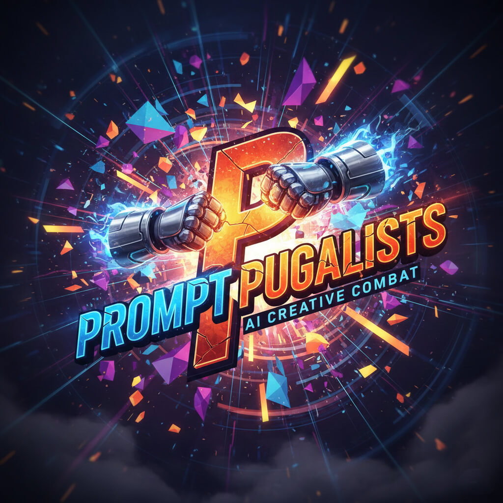

<p align="center">
  
</p>

<h1 align="center">Prompt Pugilists</h1>

<p align="center"><strong>A multiplayer AI fighting game where your words are your weapons.</strong></p>

Two players. Custom characters. Natural language combat. AI-generated video. Live voice narration. All running in real time.

Built for the [Supercell AI Hackathon 2026](https://luma.com/qkcem6mi). [Project Page](https://eu.junctionplatform.com/projects/supercell-ai-hackathon/view/698803ca1d0c2c060b93d96c).

---

## How It Works

Prompt Pugilists uses a **Jackbox-style local multiplayer** model: one shared screen (the host) displays the battle, while players control their fighters from their phones.

### Game Flow

1. **Host** creates a room and picks a battle arena — gets a 6-character room code
2. **Players** join on mobile, pick their characters, and ready up
3. **Battle begins** — each round, players choose from 4 AI-generated action buttons or write a freeform prompt describing what they want to do
4. **AI resolves** the round: interprets both actions, rolls dice, calculates damage, and simultaneously generates a video prompt, narrator script, and new action choices
5. **The host screen** renders a real-time AI video of the battle with live voice commentary
6. **Repeat** until someone hits 0 HP

### What Makes It Tick

The core innovation is **a single AI orchestration layer** (Mistral) that takes both player actions and produces coordinated output for every downstream system at once:

- **Combat resolution** with transparent dice mechanics (d20 to hit, 2d6+ for damage)
- **Video direction** sent to Reactor LiveCore for real-time AI video generation
- **Narrator script** in the style of a Champions League commentator, delivered via AI voice synthesis
- **4 new contextual action choices** per player (attack, magic, defend, heal) that evolve with the battle state
- **Battle memory** — a cumulative narrative summary so the AI remembers what happened

Characters have **visual fingerprints** — text descriptions generated by Mistral Vision from each character's image — ensuring they look consistent across every generated video frame.

---

## Tech Stack

| Layer             | Tech                                                    |
| ----------------- | ------------------------------------------------------- |
| **Client**        | React 19, Vite 6, Tailwind CSS v4, Wouter, Zustand      |
| **Server**        | Express, Socket.io, SQLite (better-sqlite3), TypeScript |
| **Combat AI**     | Mistral (`mistral-large-latest`)                        |
| **Image Gen**     | Decart Lucy Pro (t2i / i2i)                             |
| **Video Gen**     | Reactor LiveCore (client-side WebRTC)                   |
| **Image Hosting** | ImgBB                                                   |
| **Voice**         | Neocortex TTS                                           |

---

## Getting Started

### Prerequisites

- Node.js 20+
- API keys for: [Mistral](https://console.mistral.ai/), [Decart](https://decart.ai/), [ImgBB](https://api.imgbb.com/)
- Optional: [Reactor](https://reactor.ai/) API key for video generation

### Setup

```bash
# Clone
git clone https://github.com/your-username/prompt-pugalists.git
cd prompt-pugalists

# Server
cd server
cp .env.example .env       # Fill in your API keys
npm install
npm run dev                 # Starts on :3000

# Client (new terminal)
cd client
npm install
npm run dev                 # Starts on :5173, proxies API to :3000
```

Open `http://localhost:5173` on the host device. Players join from their phones on the same network.

### Environment Variables

**Server** (`server/.env`):

```
MISTRAL_API_KEY=           # Required — powers combat, narration, action gen
DECART_API_KEY=            # Required — character image generation
IMGBB_API_KEY=             # Required — image hosting
PORT=3000
CLIENT_URL=http://localhost:5173
DATABASE_PATH=./game.db
```

**Client** (`client/.env`):

```
VITE_REACTOR_API_KEY=      # Optional — enables real-time video generation
```

### Docker

```bash
docker build -t prompt-pugalists .
docker run -p 3000:3000 --env-file server/.env prompt-pugalists
```

---

## Architecture

```
┌─────────────────────────────────────────────────────┐
│                   HOST DISPLAY                       │
│  ┌──────────────┐  ┌──────────┐  ┌──────────────┐  │
│  │ Reactor Video │  │ HP Bars  │  │  AI Voice    │  │
│  │  (WebRTC)     │  │          │  │  Narration   │  │
│  └──────────────┘  └──────────┘  └──────────────┘  │
└──────────────────────┬──────────────────────────────┘
                       │ Socket.io
┌──────────────────────┴──────────────────────────────┐
│                     SERVER                           │
│  ┌─────────────┐  ┌─────────────┐  ┌────────────┐  │
│  │ RoomManager  │  │BattleManager│  │  Mistral    │  │
│  │ (in-memory)  │  │             │  │  AI Engine  │  │
│  └─────────────┘  └─────────────┘  └────────────┘  │
│  ┌─────────────┐  ┌─────────────┐  ┌────────────┐  │
│  │   SQLite     │  │   Decart    │  │   ImgBB    │  │
│  └─────────────┘  └─────────────┘  └────────────┘  │
└──────────────────────┬──────────────────────────────┘
                       │ Socket.io
        ┌──────────────┴──────────────┐
┌───────┴───────┐             ┌───────┴───────┐
│   PLAYER 1    │             │   PLAYER 2    │
│   (Mobile)    │             │   (Mobile)    │
│ Action buttons│             │ Action buttons│
│ + freeform    │             │ + freeform    │
└───────────────┘             └───────────────┘
```

---

## Project Structure

```
prompt-pugalists/
├── client/src/
│   ├── pages/           # Landing, Join, Battle, HostDisplay, Characters, etc.
│   ├── components/      # CharacterForm, ReactorVideo, VideoOverlay
│   ├── stores/          # Zustand game store (session, room, battle state)
│   ├── lib/             # API client, socket client, session mgmt, TTS
│   └── hooks/           # Voice announcer hook
├── server/src/
│   ├── managers/        # RoomManager (ephemeral rooms), BattleManager
│   ├── ai/              # Mistral (combat), Decart (images), ImgBB (hosting)
│   ├── socket/          # WebSocket event handlers
│   ├── routes/          # REST API (characters, rooms, uploads, suggestions)
│   └── db/              # SQLite setup + schema
├── SPEC.md              # Full technical specification
├── CLAUDE.md            # Development guide
└── Dockerfile
```

---

## License

MIT
